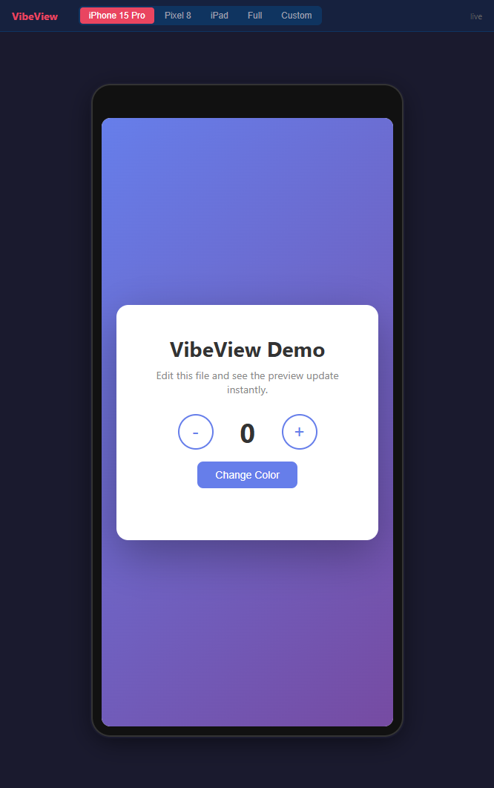
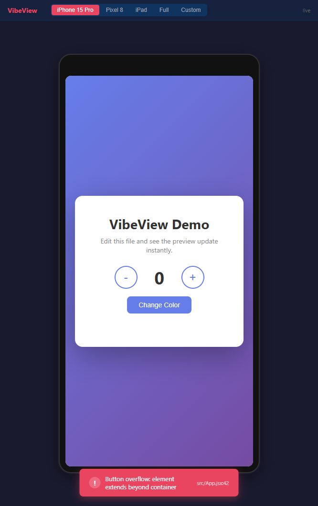
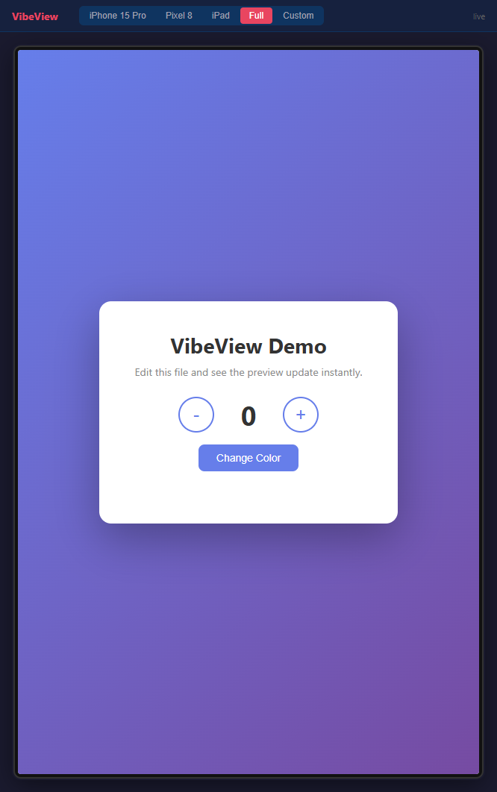

# VibeView

**"所见即所写——实时看到 AI 写出的界面。"**

VibeView 是一款 CLI 工具，为 vibe coding 提供 Android Studio 式的即时 UI 预览。编辑器写代码，浏览器实时渲染，无需手动刷新。同时也是一个 MCP Server，让 Claude Code 能"看见"渲染结果并自动修复 UI 问题。

<p align="center">
  
</p>

## 功能特性

- **一行命令启动** — 在前端项目目录下直接运行 `vibeview`
- **框架自动识别** — React (Vite)、Vue (Vite)、Svelte (Vite)、纯 HTML
- **即时热更新** — 文件变更通过 WebSocket 推送，100ms 防抖
- **设备外框** — iPhone 15 Pro、Pixel 8、iPad、全宽、自定义尺寸
- **错误边界** — JS 报错显示红色错误卡片，不会白屏，修复后自动消失
- **终端桥接** — 浏览器错误实时转发到终端 stderr
- **MCP Server** — 5 个工具让 Claude Code 查看并与预览交互

<p align="center">
  
  
</p>

## 快速开始

### 安装

```bash
# 克隆并编译
git clone https://github.com/Kasyou/VibeView.git
cd VibeView
go build -o vibeview.exe .

# 或者用 go install（需要 Go 1.23+）
go install github.com/Kasyou/VibeView@latest
```

### 使用

```bash
# 在任何前端项目中启动预览
cd my-react-app
vibeview

# 浏览器打开 http://localhost:51820
```

```bash
# 自定义端口和目录
vibeview --port 3000 --dir ~/my-project

# 查看帮助
vibeview help
```

### 配合 Claude Code 使用 (MCP)

在项目中添加 `.mcp.json`：

```json
{
  "mcpServers": {
    "vibeview": {
      "command": "vibeview",
      "args": ["mcp"],
      "env": {
        "VIBEVIEW_URL": "http://localhost:51820"
      }
    }
  }
}
```

Claude Code 即可使用以下工具：

| 工具 | AI 可以做什么 |
|------|-------------|
| `preview_screenshot` | 截取当前预览画面 |
| `preview_inspect` | 查询元素样式、位置、尺寸 |
| `preview_console` | 读取浏览器控制台错误/警告 |
| `preview_diff` | 对比前后截图，检测变化 |
| `preview_reload` | 触发预览刷新 |

### AI 自我修正流程

```
Claude 生成 React 组件
  → preview_screenshot 截图
  → 发现按钮溢出
  → 自动修复 CSS
  → preview_screenshot 再次截图验证
  → 向用户展示最终结果
```

## 架构

```
Cursor/IDE (用户编辑代码)
    │ 文件变更
    ▼
VibeView 核心 (Go 单二进制, ~8MB)
    ├── 文件监控 (fsnotify, 100ms 防抖)
    ├── HTTP 服务器 (:51820)
    │   ├── /        → 嵌入式预览页面
    │   ├── /_app/*  → 托管项目文件 (HTML 模式)
    │   ├── /ws      → WebSocket (reload, console, screenshot, inspect)
    │   └── /api/*   → REST 接口
    └── MCP Server (stdio JSON-RPC)
    │ WebSocket → 浏览器预览
    ▼
浏览器预览窗口
    ├── 设备外框 (iPhone/Pixel/iPad/Full/自定义)
    ├── iframe → 用户项目 (Vite dev server 或本地文件)
    ├── 错误边界 (红色卡片覆盖层, 自动消失)
    └── 终端转发 → WebSocket → 终端
```

## 支持的框架

| 框架 | 检测方式 | 热更新 |
|------|---------|--------|
| React (Vite) | `package.json` + `vite.config.*` | Vite 内置 HMR |
| Vue (Vite) | `package.json` + `vite.config.*` | Vite 内置 HMR |
| Svelte (Vite) | `package.json` + `vite.config.*` | Vite 内置 HMR |
| 纯 HTML | 存在 `index.html` | VibeView 强制刷新 |

## 技术栈

- **Go 1.23+** — 编译为单二进制文件，`go:embed` 嵌入前端
- **fsnotify** — 跨平台文件监控
- **gorilla/websocket** — WebSocket 实时推送
- **原生 HTML/CSS/JS** — 零依赖的渲染器 UI，嵌入在二进制中

## 从源码编译

```bash
git clone https://github.com/Kasyou/VibeView.git
cd VibeView
go build -ldflags="-s -w" -o vibeview .

# 交叉编译所有平台
bash scripts/build.sh 0.1.0
```

## License

MIT
