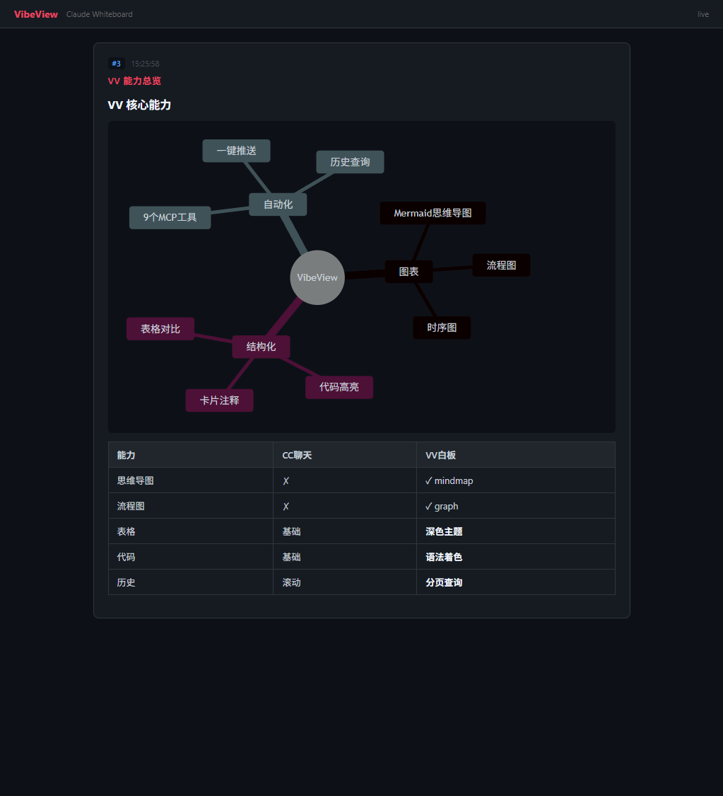
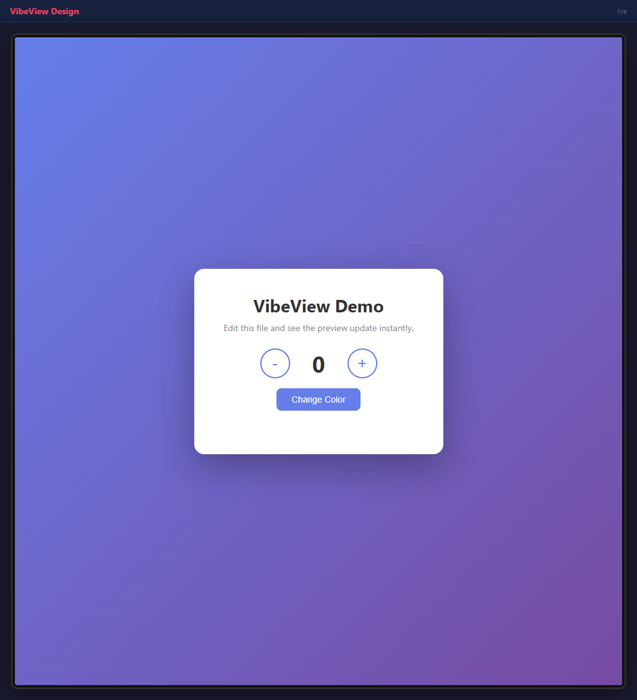

# VibeView

**Claude Code 的可视化输出白板。** Mermaid 图表、结构化卡片、代码高亮。CC 是文字 — VV 是可视化。

<p align="center">
  
</p>

## 双模式

| 模式 | 命令 | 端口 | 用途 |
|------|------|------|---------|
| Claude 白板 | `vibeview` | 51820 | AI 推理 → 图表 + 卡片 |
| Design 预览 | `vibeview design` | 51821 | 代码 → 即时 UI 预览 |

### Design 预览

<p align="center">
  
</p>

Cursor 暗色主题。设备框。热更新。自动识别 React/Vue/Svelte/HTML。

## VV vs CC

| CC 聊天不能 | VV 白板能 |
|------------|----------|
| 思维导图 | `mindmap` — 层级可视化 |
| 流程图 | `graph TD` — 决策树、架构图 |
| 时序图 | `sequenceDiagram` — API 调用链 |
| 甘特图 | `gantt` — 项目计划 |
| 代码高亮 | GitHub-dark 多语言配色 |
| 卡片注释 | #序号 · 时间戳 |
| 历史搜索 | `preview_history` 分页查询 |

### 智能浏览器

VV 自动检测内容类型。含图表 → 提示用外置浏览器。纯文字/表格 → Cursor 内置浏览器。

## 快速开始

```bash
go install github.com/Kasyou/VibeView@latest
vibeview            # 白板 :51820
vibeview design     # 预览 :51821
```

## 9 个 MCP 工具

| 工具 | 用途 |
|------|------|
| `preview_show` | 推送 Markdown + 图表 |
| `preview_clear` | 清空白板 |
| `preview_history` | 分页历史 |
| `preview_screenshot` | 截取预览图 |
| `preview_inspect` | 元素查询 |
| `preview_console` | 浏览器错误 |
| `preview_diff` | 前后对比 |
| `preview_reload` | 强制刷新 |
| `preview_stop` | 关闭服务器 |

## 编译

```bash
git clone https://github.com/Kasyou/VibeView.git
cd VibeView && go build -o vibeview .
# 二进制约 12MB（内嵌 Mermaid.js）
```

37 测试 · Go 1.23+ · Windows/macOS/Linux · MIT
